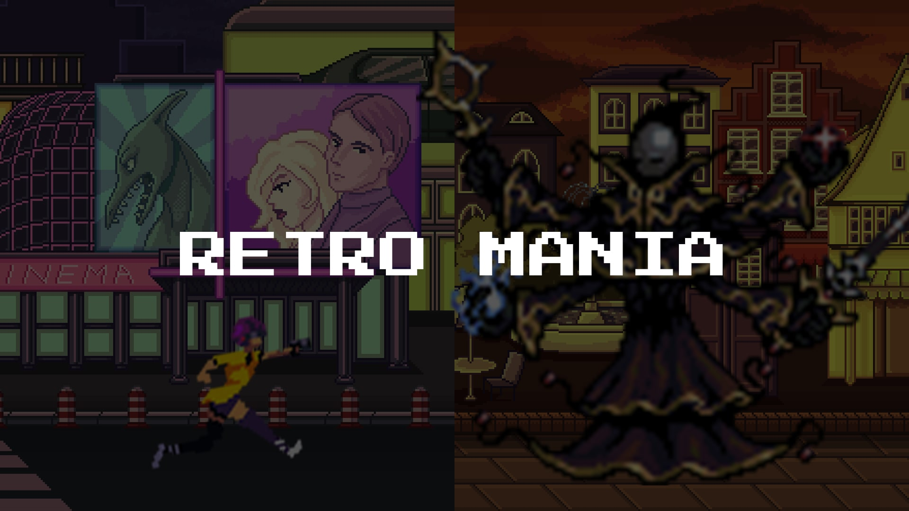

> Save the knight or else he dies

## 🐲 STORY

A long time ago, in a land far away, there was a kingdom that was cursed by an evil sorcerer. The kingdom was called `Retro`. Before the curse, Retro was one of the happiest places in the world. When the cursed happened, everything changed. People started turning into zombies, monsters.

Seeing how the Retro was slowly becoming a graveyard, the King decided to send the bravest of his knights to capture the evil sorcerer. During the knight's quest, he got tricked by the sorcerer and was led into a trap. The news of the knight's capture spread like the wildfire in the kingdom. Everyone became petrified thinking that there is no hope anymore.

At that grave time, a young lady who claimed that she was from the future stepped forward. She undertook the quest of destroying the evil sorcerer and saving the knight and along with him the entire kingdom.

## ⚡️ DEMO


## 💥 PLATFORM

We used [Godot Engine](https://github.com/godotengine/godot) to develop this game. Godot is an open-source software that uses GDScripts or C# for game development. For this project, we went with GDScripts.

## 👨🏻‍💻 LOCAL DEVELOPMENT

1. Download & install Godot. You can download it from [here](https://godot-engine.en.uptodown.com/windows).
2. Clone this repo. For that run the following command in the terminal:

```sh
git clone https://github.com/MLH-Fellowship/RetroMania.git
```

3. Open Godot Engine and import this cloned project.
4. Now click on the play button located at the top right corner. It will start the game

## 💻 CONTRIBUTORS

- [Nkosilathi Tauro](https://github.com/nkosi-tauro)
- [Saad Irfan](https://github.com/msaaddev)
- [Levy Naibei](https://github.com/Levy-Naibei)

## 🔑 LICENSE

- MIT
